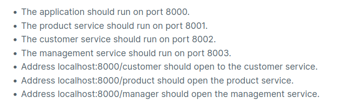

[](https://classroom.github.com/a/WXJwttMj)


# Noroff

## Back-end Development Year 2

### Note



Because in the instructions were some inconsistencies, in some places it was saying /manager as the picture above and in other places it was saying /management, I chose the first one as the picture. I talk with Frederick Johannes Botha and he told me to keep it
as it is and it is ok and just to add a note here.

### Start Project

```
cd gateway
// start the gateway and the microservices
npm run startall

// or start one by one by going to gateway, products, management and customer folders
// and run
npm start

```

### Note


Because in the instructions were some inconsistencies, in some places was saying /manager as the picture above and in other places was saying /management, I chose the first one as the picture. I talk with Frederick Johannes Botha and he told me to keep it
as it is and it is ok.

### Semester Project 2 - Course Assignment

Startup code for Noroff back-end development 2 - SP2.

Instruction for the course assignment is in the LMS (Moodle) system of Noroff.
[https://lms.noroff.no](https://lms.noroff.no)


You will not be able to make any submission after the deadline of the course assignment. Make sure to make all your commit **BEFORE** the deadline


If you are unsure of any instructions for the course assignment, contact out to your teacher on **Microsoft Teams**.

**REMEMBER** Your Moodle LMS submission must have your repository link **AND** your Github username in the text file.
